# Prometheus Learning - First Sample

> "Learn Prometheus with hands-on examples, PromQL queries, and cost optimization use cases for Kubernetes"

---

## Overview

This repository provides practical, hands-on training for Prometheus, a CNCF-graduated monitoring and alerting system. The focus goes beyond basic monitoring, it demonstrates how to use Prometheus for **cost optimization** by combining metrics with Kyverno policy enforcement.

---

## Key Learning Objectives

The materials cover:

- Prometheus stack deployment on Kubernetes with kube-prometheus-stack
- PromQL fundamentals and advanced queries for cost and utilization analysis
- Grafana dashboard design for cost attribution and resource efficiency
- Kyverno integration for cost governance and policy-as-code
- Prometheus + Kyverno governance loop for automated optimization

---

## Repository Organization

```
prometheus-first-sample/
├── setup/                   # Helm values and installation scripts
├── promql-queries/          # PromQL queries for cost, utilization, waste, SLOs
├── grafana-dashboards/      # Pre-built dashboards for cost and efficiency
├── kyverno-policies/        # Cost governance policy enforcement
└── examples/                # Sample workloads for testing and demonstration
```

---

## Quick Start Steps

1. Clone the repository
2. Run `chmod u+x ./setup/minikube-cluster.sh` and execute it to create the cluster
3. Run `chmod u+x ./setup/install.sh` to make the script executable
4. Execute `./setup/install.sh` to deploy the full Prometheus stack
5. Apply sample workloads:
   ```bash
   kubectl apply -f examples/sample-app.yaml
   kubectl apply -f examples/overprovisioned-app.yaml
   ```
6. Install Kyverno and apply cost governance policies:
   ```bash
   helm repo add kyverno https://kyverno.github.io/kyverno/
   helm install kyverno kyverno/kyverno -n kyverno --create-namespace
   kubectl apply -f kyverno-policies/require-resource-limits.yaml
   kubectl apply -f kyverno-policies/require-cost-labels.yaml
   kubectl apply -f kyverno-policies/validate-resource-ratios.yaml
   kubectl apply -f kyverno-policies/generate-cost-report.yaml
   ```
7. Start port-forwards (run each in background):
   ```bash
   kubectl port-forward svc/kube-prometheus-stack-grafana 3000:80 -n monitoring &
   kubectl port-forward svc/kube-prometheus-stack-prometheus 9090:9090 -n monitoring &
   ```
8. Import Grafana dashboards:
   - Open [http://localhost:3000](http://localhost:3000) (credentials: `admin` / `prom-operator`)
   - Go to **Dashboards → Import**
   - Import `grafana-dashboards/cost-overview.json` — namespace cost attribution
   - Import `grafana-dashboards/resource-efficiency.json` — right-sizing & waste detection
9. Explore PromQL queries:
   - Open [http://localhost:9090](http://localhost:9090) and go to **Graph**
   - Or use **Grafana → Explore** ([http://localhost:3000/explore](http://localhost:3000/explore)) for a richer query experience
   - Query files available in `promql-queries/`:
     - `cost-attribution.promql` — cost per namespace and team
     - `utilization.promql` — CPU and memory utilization tracking
     - `waste-detection.promql` — over-provisioned workload detection
     - `capacity-planning.promql` — trend-based capacity forecasting
     - `slo-monitoring.promql` — SLO/SLA compliance queries
10. Clean up all resources when done:
    ```bash
    chmod u+x ./setup/cleanup.sh
    ./setup/cleanup.sh
    ```

---

## The Governance Loop

What makes this sample unique is the combination of **observability with policy-as-code**:

```mermaid
flowchart TD
    K["🛡️ Kyverno<br/>(Policy Engine)<br/>Enforce resource limits<br/>& cost labels on every deployment"]
    C["☸️ Kubernetes Cluster<br/>All pods have proper limits,<br/>labels, and annotations"]
    P["🔥 Prometheus<br/>(Metrics)<br/>Collect accurate metrics<br/>(limits exist → data is meaningful)"]
    G["📊 Grafana<br/>(Dashboards)<br/>Visualize cost attribution,<br/>utilization, and waste"]

    K -->|"Admission webhook<br/>blocks non-compliant pods"| C
    C -->|"Scrape metrics<br/>from labeled workloads"| P
    P -->|"Query PromQL<br/>datasets"| G
    G -->|"Alerts & insights<br/>trigger policy reviews"| K
```



**Without Kyverno:** Prometheus collects metrics, but pods without resource limits produce meaningless utilization data.

**With Kyverno:** Every pod has enforced limits and cost labels → Prometheus metrics become actionable for cost optimization.

---

## Cost Attribution with Labels

Consistent labeling is the foundation of cost visibility. This sample enforces:

| Label | Purpose | Example |
|-------|---------|---------|
| `team` | Cost ownership | `team: payments` |
| `project` | Budget allocation | `project: treasury-api` |
| `environment` | Env segmentation | `environment: production` |
| `cost-center` | Financial mapping | `cost-center: CC-1234` |

---

## Prerequisites

- Minikube, kind, or k3d (local Kubernetes cluster)
- kubectl 1.28+
- Helm v3
- 4 CPU cores and 8GB RAM minimum

---

## Related Resources

- Official Prometheus documentation at prometheus.io/docs
- PromQL query basics and reference
- kube-prometheus-stack Helm chart
- Kyverno policy library and documentation
- Community: CNCF Slack #prometheus

---

## License
This repository is licensed under Creative Commons Attribution-ShareAlike 4.0 International License.

[](https://creativecommons.org/licenses/by-sa/4.0/)

